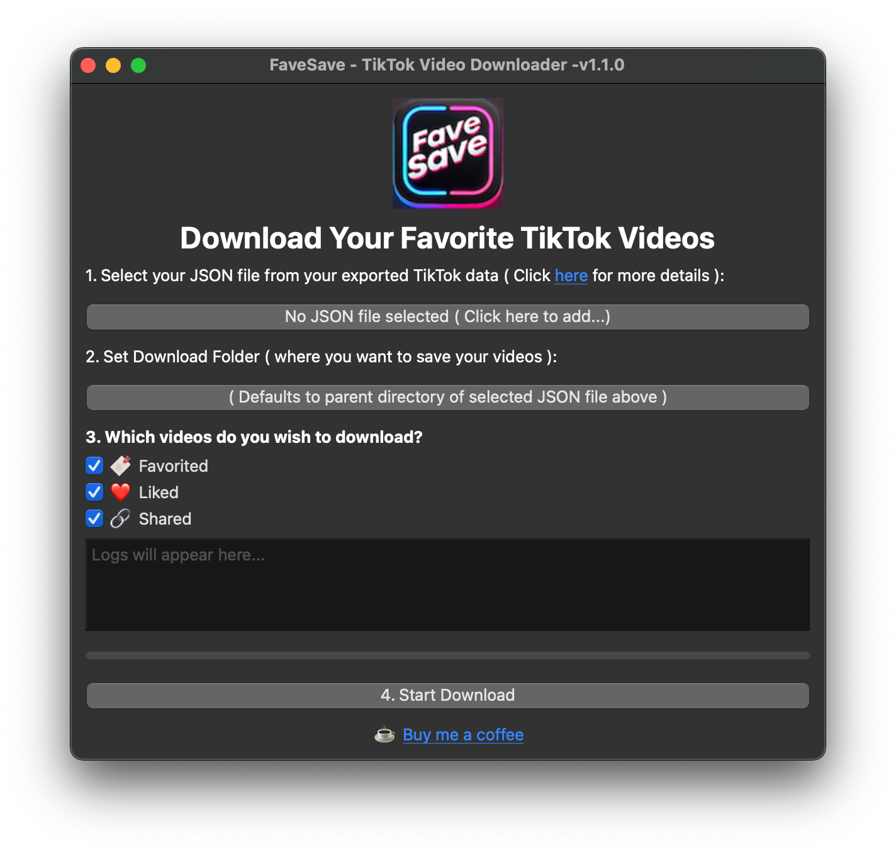
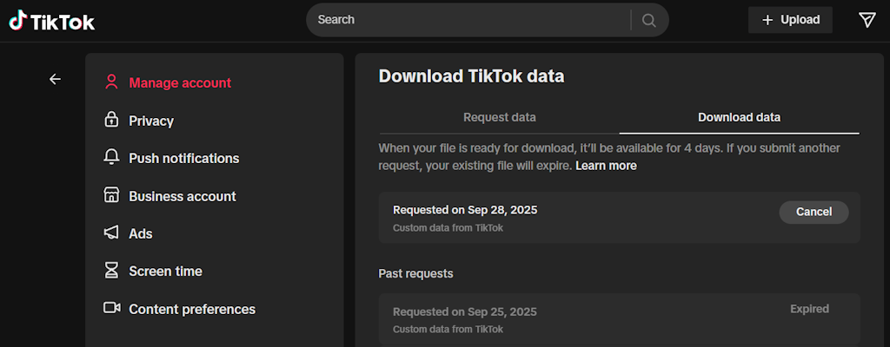

# TikTok FaveSave

FaveSave is a free-to-use desktop app that automatically downloads your favorite and liked TikTok videos ( via [yt_dlp](https://github.com/yt-dlp/yt-dlp) ) using your exported profile data.

## How To Use

1. First you'll need to visit TikTok’s [data request page](https://support.tiktok.com/en/account-and-privacy/personalized-ads-and-data/requesting-your-data#1).

2. Submit a data request, choosing JSON as your export format.

3. Wait for TikTok to process your request.

4. Once your data is ready, download it from TikTok and extract the folder.

5. Download the FaveSave zip from the [releases](https://github.com/joeycato/tiktok-favesave/releases) page and extract it to a local folder ( or if you prefer you can build and run it locally from the source code with the _run_app.sh_ script ). After launching it, select the location of your JSON file ( e.g. _user_data_tiktok.json_ ) , choose your output folder and preferences, then click **Start Download** to fetch your videos.

Note: Videos that have already been downloaded will be skipped ( in case you wish to re-run the app later and resume operation )

## License

This software is provided "as-is" without warranty of any kind. By using this software, you agree to the terms of the attached license. Redistribution, modification, or commercialization of this software is prohibited without explicit permission from the author. For additinal details, please refer to this [license](./LICENSE) file
